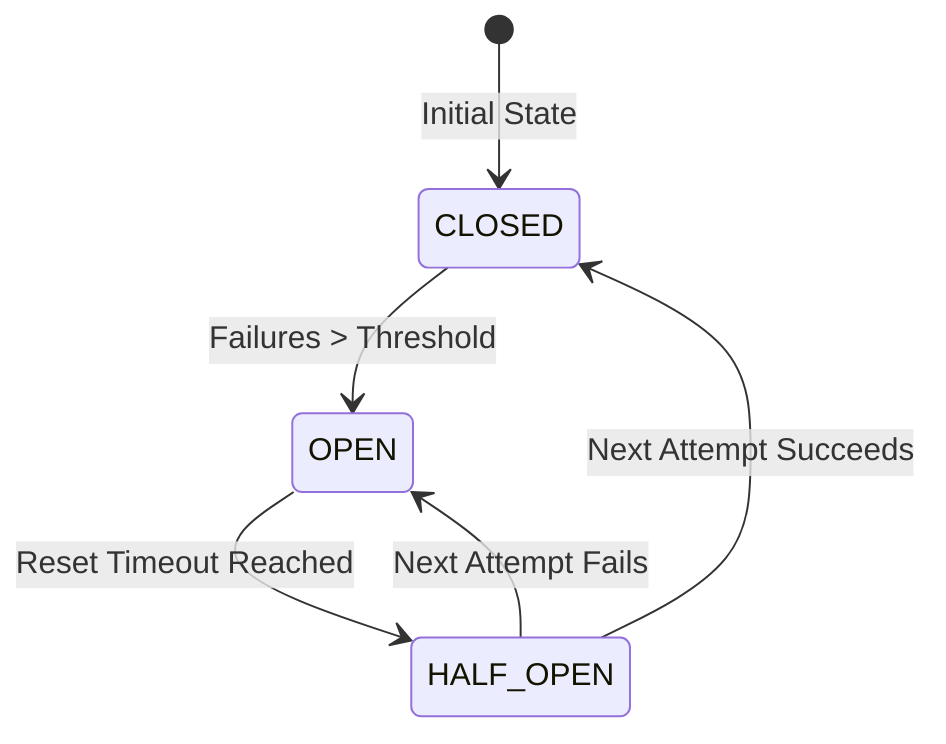

# Agentic Circuit Breaker

[](https://badge.fury.io/js/agentic-circuit-breaker)
[](https://opensource.org/licenses/MIT)

A zero-dependency TypeScript implementation of the **Stateful Circuit Breaker** pattern, engineered specifically for Agentic AI workflows and LLM API routing.

## The Problem

When autonomous AI agents encounter upstream LLM API rate limits (HTTP 429) or provider outages (HTTP 500), they often enter recursive retry loops. This results in:
1.  **Cascading Failures:** Exhausting edge compute time limits.
2.  **Token Burn:** Wasting money on failed API attempts.
3.  **Agent Deadlocks:** The agent hangs instead of gracefully degrading to a fallback model.

## The Solution (Borrowed from Data Center Ops)

In physical data centers, if a CRAC (cooling) unit fails, you don't keep routing power to the servers—you trip the circuit to prevent a thermal runaway. 

This library applies that exact deterministic infrastructure pattern to non-deterministic AI agents.



### States:
*   🟢 **CLOSED:** API calls route normally to the primary LLM.
*   🔴 **OPEN:** The circuit is tripped. Primary LLM calls immediately fail (or route to fallback) without burning network time.
*   🟡 **HALF_OPEN:** After a timeout, one test call is permitted to see if the primary LLM has recovered. Other calls that arrive while the test call is running use the fallback, or throw `CircuitOpenError` when there is none. The breaker has no call timeout of its own, so a test call that never settles keeps the others waiting: give your primary action a timeout.

## Installation

```bash
npm install agentic-circuit-breaker
```

## Quick Start

```typescript
import { AgentCircuitBreaker } from "agentic-circuit-breaker";

// Initialize with a failure threshold of 3, and a 15-second recovery wait.
const llmBreaker = new AgentCircuitBreaker({
  failureThreshold: 3, 
  resetTimeoutMs: 15000 
});

async function processAgentTask(task) {
  return await llmBreaker.execute(
    // Primary Action (e.g., call OpenAI/Anthropic/Gemini)
    async () => await callPrimaryLLM(task),
    
    // Fallback Action (e.g., call local Ollama Llama-3)
    async () => await callFallbackLLM(task)
  );
}
```

### Watching state changes

Pass `onStateChange` to be told whenever the breaker moves between states, for logging or metrics:

```typescript
const llmBreaker = new AgentCircuitBreaker({
  failureThreshold: 3,
  resetTimeoutMs: 15000,
  onStateChange: (from, to) => {
    console.log(`circuit breaker: ${from} -> ${to}`);
  },
});
```

*   It is called once per real change, after the state has been updated: `CLOSED -> OPEN` when the failure threshold is reached, `OPEN -> HALF_OPEN`, and `HALF_OPEN -> CLOSED` or `HALF_OPEN -> OPEN` when the trial call finishes. It is not called for calls that change nothing, or for reading the state.
*   `OPEN -> HALF_OPEN` is detected lazily, the first time `getState()` or `execute()` runs after the wait is over, so the callback fires then (the breaker has no timer of its own).
*   The callback may return a promise. If it throws or rejects, the error is swallowed: a faulty listener never changes the result of the call it observes, and never causes an unhandled rejection. Handle your own errors inside it if you need to see them.

## Why Not `resilience4js` or `opossum`?

While excellent libraries exist for microservices, `agentic-circuit-breaker` is hyper-optimized for the edge (e.g., Cloudflare Workers). It avoids Node.js specific modules (like `EventEmitter`), making it lightweight enough to run directly in edge environments where modern AI routers live.

## Author

**Sachin Kumar Sharma**  
Agentic AI Platform Architect | Infrastructure Veteran (20yrs)  
[VirtualSach.in](https://virtualsach.in)
